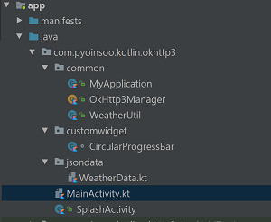
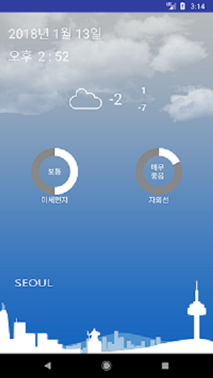

## Kotlin OkHttp3 
* **[OkHttp3](http://square.github.io/okhttp/)**
* **[OkHttp3 + Intercepter](https://github.com/square/okhttp/wiki/Interceptors) 연동방법**
## Be sure to read
* **Developed in Android Studio 3.0**
* **Kotlin Android Extendsion**
## Project 구조

## Screenshot

## build.gradle
```gradle
   //Gson Dependency
    compile 'com.google.code.gson:gson:2.8.2'

    /*
     * OkHttp3 Dependencies
     */
    compile 'com.squareup.okhttp3:okhttp:3.9.0'
    compile 'com.squareup.okhttp3:logging-interceptor:3.8.1'
```
## OkHttp3 + Intercepter 연결하기(OkHttp3Manager.kt)
```kotlin
/*
 * Created by pyoinsoo on 2018-01-11.
 * insoo.pyo@gmail.com
 * OkhttpClient를 싱글톤으로 만들고
 * Intercepter를 세팅한다
 */
object OkHttp3Manager {

    private val ALL_TIMEOUT = 10L

    /*
     * SK 개발자 Key를 등록한다
     */
    private val SK_API_KEY =
 MyApplication.myApplication.resources.getString(R.string.sk_weather_api_key)

    /*
     * Native HTTP통신을 위해 OkHttp3를 선언
     */
    private var okHttpClient: OkHttpClient

    /*
     * Request Header을 세팅하는 Interceptor
     * 요청을 보낼때 마다 다음을 기본적으로 세팅한다
     */
    private  class HeaderSettingInterceptor : Interceptor {

        @Throws(IOException::class)
        override fun intercept(chain: Interceptor.Chain): Response {

            val chainRequest = chain.request()
            /*
             * Response Type과 SK 개발자Key을 등록한다
             */
            val request = chainRequest.newBuilder().apply{
                addHeader("Accept", "application/json")
                addHeader("appKey", SK_API_KEY)
            }.build()

            return chain.proceed(request)
        }
    }
    init{
        /*
         * HTTP 상태를 알아보기 위해 Http Login Interceptor를 설정한다
         */
        val httpLogging = HttpLoggingInterceptor()
        httpLogging.level = HttpLoggingInterceptor.Level.BASIC

        /*
         * OkHttp3 통신에 Interceptor와 Socket(I/O) 환경을 설정
         */
        okHttpClient = OkHttpClient().newBuilder().apply {

            addInterceptor(httpLogging)
            addInterceptor(HeaderSettingInterceptor())
            connectTimeout(ALL_TIMEOUT, TimeUnit.SECONDS)
            writeTimeout(ALL_TIMEOUT, TimeUnit.SECONDS)
            readTimeout(ALL_TIMEOUT, TimeUnit.SECONDS)

        }.build()
    }
    fun getOkHttpClient() = okHttpClient

    /*
     * 날씨 정보를 요청하는 SK HOST
     */
    const val SK_SCHEME = "http"
    const val SK_HOST = "apis.skplanetx.com"

    /*
     * SK Weather Center로 가는  URL과 Query String
     * 을 만들어 낸다
     * 좌표는 서울의 중심좌표이다
     */
    fun makeHttpURL(targetURL:String) : HttpUrl {
        return HttpUrl.Builder().apply{
                   scheme(SK_SCHEME)
                   host(SK_HOST)
                   addPathSegments(targetURL)
                   addQueryParameter("version","1")
                   addQueryParameter("lat","37.572978")
                   addQueryParameter("lon","126.989061")
               }.build()
    }

```
## 날씨(미세먼지,자외선)정보 요청하는 코드(MainActivity.kt)
```kotlin
 override fun onResume() {
        super.onResume()

        /*
         * 병렬 Thread를 이용해 요청을 실행한다
         */
        //현재 날씨(최저/최고포함)상태를 알아온다
        WeatherRESTRequest().executeOnExecutor(
                       AsyncTask.THREAD_POOL_EXECUTOR,
                       WEATHER_CURRENT_MINUTELY)

        //현재 미세먼지 정보를 가져온다                
        WeatherRESTRequest().executeOnExecutor(
                       AsyncTask.THREAD_POOL_EXECUTOR,
                       WEATHER_DUST)

        //현재 자외선 정보를 가져온다
        WeatherRESTRequest().executeOnExecutor(
                       AsyncTask.THREAD_POOL_EXECUTOR,
                       WEATHER_WINDEX_UVINDEX)

    }
    /*
     * 각 http요청를 실행하는 AsyncTask 클래스
     */
    inner class WeatherRESTRequest : AsyncTask<String, Unit,     
                                      CurrentWeather>() {

        var restTargetURL: String? = null

        override fun doInBackground(vararg params: String): 
                   CurrentWeather? {

            //요청(URL)의 종류(현재날씨,미세먼지,자외선)
            restTargetURL = params[0]


            val toRESTServer = OkHttp3Manager.getOkHttpClient()

            //요청URL정보(질의문자열 포함)를 가져온다
            val httpURL: HttpUrl = 
                 OkHttp3Manager.makeHttpURL(params[0].trim())

            val request = Request.Builder().apply {
                                               url(httpURL)
                                            }.build()
            //요청보내고 결과를 가져온다
            val response:Response = 
                  toRESTServer.newCall(request).execute()

            //JSON을 Data 객체로 변환(JSON 직렬화)
            var currentWeather:CurrentWeather? = null

            /*
             * OkHttp3의 Response는 닫아준다
             * use() 함수는 Closeable를 구현한 객체를 사용 후
             * 닫아주는 역할을 한다(try..catch..finally를 대신)
             */
            response.use {
                if (response.isSuccessful) {
                    val gson = Gson()
                    /*
                     * 넘어온 json을 gson을 이용해
                     * 객체화 한다
                     */
                    currentWeather =
                      gson.fromJson(response.body()?.string(),
                                    CurrentWeather::class.java)
                }
            }
            /*
             * GSON을 통해 변환된 객체를 리턴한다
             */
            return currentWeather
        }

        override fun onPostExecute(result: CurrentWeather?) {
            super.onPostExecute(result)

            result?.let {
                //요청 URL정보에 따라 화면을 갱신하는 함수를 호출한다
                when (restTargetURL) {

                    WEATHER_CURRENT_MINUTELY ->
                          setUICurrentWeather(result)

                    WEATHER_DUST -> setUIDust(result)

                    WEATHER_WINDEX_UVINDEX -> setUIUvindex(result)

                    else -> Unit
                }
            } ?: Toast.makeText(
                    MyApplication.myApplication,
                    "데이터를 받지 못했네요",
                    Toast.LENGTH_SHORT
            ).show()
        }
    }
```
## 현재날씨를 요청하는 URL
* **http://apis.skplanetx.com/weather/current/minutely?lat=37.572978&lon=126.989061&version=1**
* **서버로 부터 넘어온 JSON(화면에 출력할 정보만 data 클래스로 구현)**
```json
{
  "weather": {
    "minutely": [
      {
       ,,,
       ,,,
        "sky": {
          "code": "SKY_A07",//현재 하늘 상태 코드
          "name": "흐림"
        },
        ,,,
        "temperature": {
          "tc": "-1.60", //현재 온도
          "tmax": "1.00",//오늘 최고 온도
          "tmin": "-7.00"//오늘 최저 온도
        },
        ,,,
      }
    ]
  },
  ,,,
  ,,,
}
```
* **위 JSON의 data class**
```kotlin
data class CurrentWeather(val weather:Weather)

class Weather{
    //현재 날씨(오늘 최저/최고)
    var minutely:ArrayList<Minutely>? = null
    ,,,
    ,,,
}
//현재 날씨에 해당하는 JSON값을 객체화
//실제 날씨정보가 들어 있는 JSON값을 객체화
data class Minutely(
        val sky:Sky,
        val temperature:Temperature
)
data class Sky(val code:String, val name:String)
data class Temperature(val tc:String, val tmax:String, val tmin:String)
```
## 미세먼지를 요청하는 URL
* **http://apis.skplanetx.com/weather/dust?lat=37.572978&lon=126.989061&version=1**
* **서버로 부터 넘어온 JSON(화면에 출력할 정보만 data 클래스로 구현)**
```json
{
  "weather": {
    "dust": [
       ,,,
       ,,,
        "pm10": {
          ,,,
          "value": "57.75" //현재 미세먼지 수치
        }
      }
    ]
  },
  ,,,
  ,,,
}
```
* **위 JSON의 data class**
```kotlin
data class CurrentWeather(val weather:Weather)

class Weather{
    ,,,
    //미세먼지
    var dust : ArrayList<Dust>? = null
    ,,,
}
//미세먼지 데이터 값
data class Dust(val pm10:Pm10)
data class Pm10(val value:String)
```
## 자외선정보를 요청하는 URL
* **http://apis.skplanetx.com/weather/windex/uvindex?lat=37.572978&lon=126.989061&version=1**
* **서버로 부터 넘어온 JSON(화면에 출력할 정보만 data 클래스로 구현)**
```json
{
  "weather": {
    "wIndex": {
      "uvindex": [
        {
          ,,,
          "day00": { //현재 자외선 정보
            ,,,
            "index": "10.00",//현재 자외선 값
            ,,,
          },
          ,,,
        }
      ],
      ,,,
    }
  },
  ,,,
  ,,,
}
```
* **위 JSON의 data class**
```kotlin
data class CurrentWeather(val weather:Weather)

class Weather{
    ,,,
    ,,,
    //자외선
    var wIndex : WIndex? = null
}
//자외선 JSON값을 객체화
data class WIndex(val uvindex:ArrayList<UvIndex>)
data class UvIndex(val day00:Day00)
data class Day00(val index:String)
```

* **본 코드의 개발키(appKey)는 sk 텔레콤에서 제공(1일 10000콜 제한)합니다**
